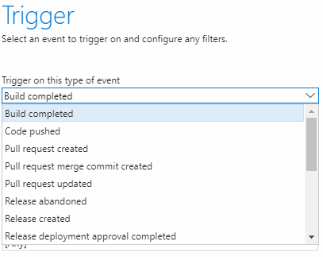
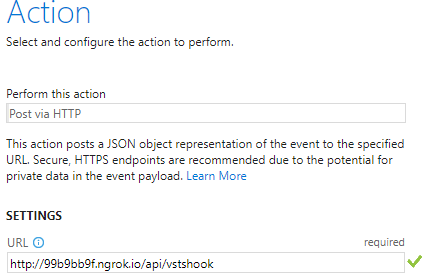

# vsts-blync-notify #

Funny project, featuring hack, to get notifications on a BlyncLight USB 30 from VSTS when events happen.


Simple node.js app to get visual notifications on a Blync USB 30 on some events from VSTS like :
* When a release just started
* When a release just completed
* When a build just completed
* When someone did a push
* ...

Works with Webhooks on VSTS.

It uses the following npm package : [blync-usb30](https://www.npmjs.com/package/blync-usb30)

## How it works ##

### Locally ###

Prerequisites, we are using ngrok to expose externally our app
```
npm install ngrok -g
```

```
git clone https://github.com/julienstroheker/vsts-blync-notify.git
cd vsts-blync-notify
npm install
npm run expose
```

Copy the forwarding address from ngrok that you have in your console, should be something like : http://99b9bb9f.ngrok.io

### VSTS ###

You have to setup the triggers that you want notification from on VSTS :

From your project, go on **Settings** - **Service Hooks** - **Create subscription** - **Web Hooks**

Choose the trigger that you want to setup



On the URL settings paste your ngrok address and add `/api/vstshook`

Example : http://99b9bb9f.ngrok.io/api/vstshook



Click on `Test` to validate if it works.

### Settings ###

Open and modify the `notify.json` file to setup your own rules.

* `type` is the from the VSTS's payload request (content.eventType)
* `color` is the color to setup on the blync
* `control` is the mode to setup on the blync

You can find more infos on `color` and `control` on [the official npm package](https://www.npmjs.com/package/blync-usb30)

Enjoy

[@ju_stroh](https://twitter.com/Ju_Stroh)
